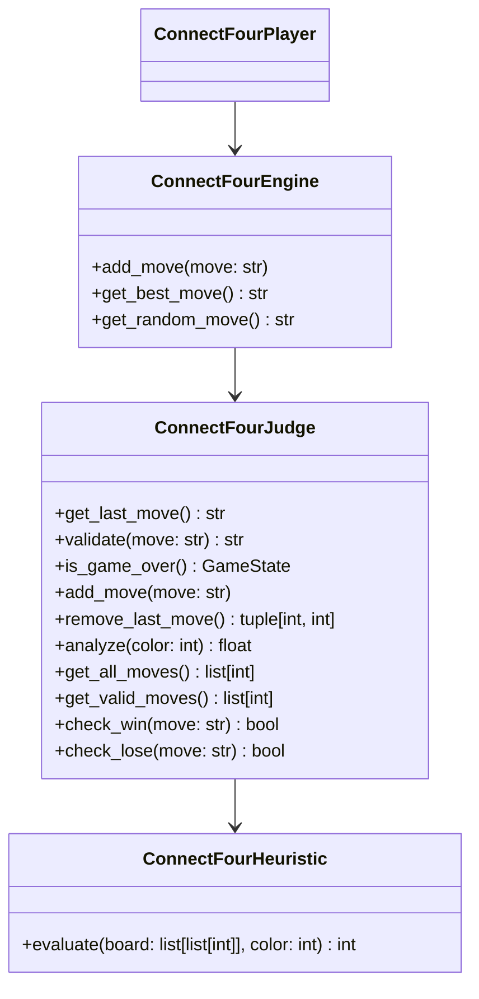

# Architecture

```mermaid
classDiagram

ConnectFourPlayer --> ConnectFourEngine
ConnectFourEngine --> ConnectFourJudge
ConnectFourJudge --> ConnectFourHeuristic


class ConnectFourEngine {
    +add_move(move: str)
    +get_best_move() str
    +get_random_move() str
}

class ConnectFourJudge {
    +get_last_move() str
    +validate(move: str) str
    +is_game_over() GameState
    +add_move(move: str)
    +remove_last_move() tuple[int, int]
    +analyze(color: int) float
    +get_all_moves() list[int]
    +get_valid_moves() list[int]
    +check_win(move: str) bool
    +check_lose(move: str) bool
}

class ConnectFourHeuristic {
    +evaluate(board: list[list[int]], color: int) int
}
```
